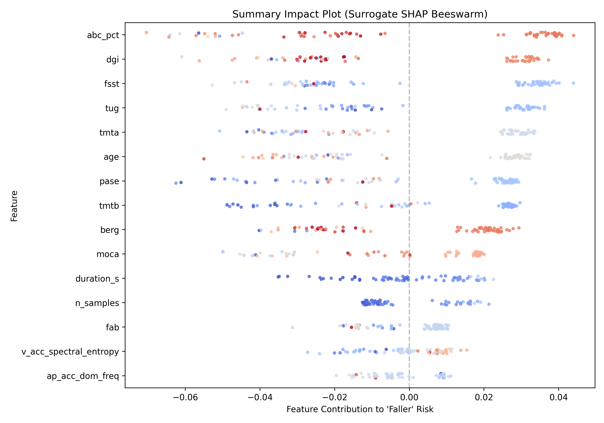

# PostuRisk

> **Classifying fallers vs non-fallers from posturography / accelerometer data
> using traditional ML with SHAP explainability.**

---

## 🎯 Project Goal

PostuRisk is a machine-learning pipeline that predicts **fall risk** in elderly
adults using 3D accelerometer signals recorded during daily living and
structured lab-walk assessments.  The project deliberately uses *traditional*
(non-deep-learning) classifiers — Random Forest, Gradient Boosting, SVM,
Logistic Regression — so that every prediction can be **explained** with
[SHAP](https://shap.readthedocs.io/) (SHapley Additive exPlanations).

### Why it matters

Falls are a leading cause of injury-related morbidity in older adults.
Identifying individuals at risk **before** a fall occurs allows for targeted
interventions (physiotherapy, environmental modifications, medication review).
Wearable accelerometers make continuous, objective monitoring feasible — but raw
sensor signals must be transformed into clinically interpretable features.

---

## 📊 Dataset

This project uses the **Long Term Movement Monitoring (LTMM) Database v1.0.0**
from [PhysioNet](https://physionet.org/content/ltmm/1.0.0/):

| Property | Value |
|---|---|
| Subjects | 71 community-living elders (age 65-87) |
| Sensors | 3D accelerometer on lower back |
| Recordings | 3-day free-living + 1-min lab walks |
| Labels | **Fallers** (≥ 2 falls/year) vs **Non-fallers** |
| Clinical scores | DGI, BBS, TUG, FSST, MMSE, ABC |
| Format | MIT/WFDB (`.dat` + `.hea`) + `.xlsx` metadata |
| License | Open Data Commons Attribution License v1.0 |

**Citation:**

> A. Weiss, M. Brozgol, M. Dorfman, T. Herman, S. Shema, N. Giladi,
> J.M. Hausdorff, *"Does the Evaluation of Gait Quality During Daily Life
> Provide Insight Into Fall Risk?"*, Neurorehabil Neural Repair, 2013.
> DOI: [10.1177/1545968313491004](https://doi.org/10.1177/1545968313491004)

---

## 🗂️ Project Structure

```
posturisk/
├── data/
│   ├── raw/            ← Downloaded PhysioNet files (git-ignored)
│   └── processed/      ← Engineered feature tables (git-ignored)
├── notebooks/          ← Exploratory analysis & visualization
├── src/
│   └── posturisk/
│       ├── __init__.py
│       └── fetch_data.py   ← Data download script
├── tests/
│   └── __init__.py
├── .gitignore
├── pyproject.toml
└── README.md
```

---

## 🚀 Quick Start

### 1. Install

```bash
# Clone the repository
git clone https://github.com/<your-org>/posturisk.git
cd posturisk

# Create a virtual environment & install in editable mode
python -m venv .venv
.venv\Scripts\activate        # Windows
# source .venv/bin/activate   # macOS / Linux

pip install -e ".[dev,notebooks]"
```

### 2. Download the data

```bash
# Download the full LTMM dataset (~20 GB)
posturisk-fetch

# Or download only the lightweight lab-walk subset + metadata (~50 MB)
posturisk-fetch --lab-walks-only
```

### 3. Run tests

```bash
pytest
```

---

## 🔬 Pipeline Overview

The project is structured incrementally natively through modular `.py` scripts and Jupyter Notebooks natively aligned exactly to each stage:

1. **Stage 1: Data Acquisition (`fetch_data.py`)** 
   * Pulls the LTMM dataset from PhysioNet. Uses local Python execution parsing `RECORDS` to download `.dat`/`.hea` waveform components plus clinical meta-files.
2. **Stage 2 & 3: Preprocessing & Feature Engineering (`preprocess.py`, `features.py`)** 
   * A custom, dependency-free WFDB (`.hea` and `.dat`) parser extracts raw 16-bit physical signals.
   * Cleans clinical metadata (median imputations and missing logic drops). 
   * Engineers **129** distinct gait features (jerk profiles, spectral bandwidth distribution, and postural sway planar approximations).
   * Runs natively using `python -m posturisk.preprocess`.
3. **Stage 4: Modelling (`train.py`)** 
   * Tunes and compares Random Forest and Support Vector Machine (RBF kernel) utilizing `RepeatedStratifiedKFold` cross-validation (5 splits, 3 repeats).
   * Validates generalized metrics on a small sample size ($n=73$) avoiding leakage, outputting rigorous Sensitivity, Specificity, Accuracy, F1, and AUC metrics.
   * Auto-pickles the champion model framework to `models/best_model.pkl`.
4. **Stage 5: Explainability (`explain.py`)** 
   * Deconstructs Random Forest probability paths using `treeinterpreter` (A pure-python module mathematically identical to TreeSHAP without MSVC compiler constraints).
   * Generates global Absolute Feature Importance rankings.
   * Generates Surrogate Beeswarm plots correlating isolated mechanical features (like `sway_path_length` or `v_acc` high-frequency turbulences) directly to shifting patient risk.
   * Provides individual Force Plots detailing precise feature attributions for False Negatives vs True Positives.

### 📓 Notebooks
* `notebooks/01_eda.ipynb` — Explores the clinical demographics, visualizes the raw waveform signatures for Fallers vs. Non-Fallers.
* `notebooks/02_features.ipynb` — Interactive visual deep dives into advanced feature correlations and engineered differences.
* `notebooks/03_model_evaluation.ipynb` — Comprehensive summary tables, confusion matrices, and ROC curves evaluating the Random Forest vs SVM classifiers.

---

## 📜 License

This project is licensed under the [MIT License](LICENSE).

## 🚀 How to Reproduce the Pipeline (End-to-End)

We intentionally bypassed rigid Makefiles to ensure seamless compatibility natively across Windows, Mac, and Linux terminals.

After creating your virtual environment and activating it, run these 5 modular steps sequentially:

```bash
# 1. Install all frozen dependencies
# Note: We deliberately use pure-python implementations like 'treeinterpreter' 
# to ensure 100% cross-architecture compatibility for Apple Silicon / Windows Parallels users!
pip install -r requirements.txt

# 2. Download the PhysioNet Dataset 
# WARNING: This pulls raw PhysioNet waveforms and requires up to 20GB of disk space/bandwidth!
python -m posturisk.fetch_data

# 3. Clean records and engineer 129 biomechanical features
python -m posturisk.preprocess
python -m posturisk.features

# 4. Train classifiers & evaluate with Repeated K-Fold CV
python -m posturisk.train

# 5. Generate Interpretability Diagnostics (Beeswarm & Force plots)
python -m posturisk.explain
```

---

## 📊 Results & Model Performance

Because identifying clinical fall risk on small datasets ($N=73$) is highly prone to overfitting, we evaluated performance using a rigorous **Repeated Stratified 5-Fold Cross Validation (3 repeats)**.

| Classifier | AUC-ROC | Accuracy | Sensitivity (Faller Rec.) | Specificity | F1 Score |
| :--- | :---: | :---: | :---: | :---: | :---: |
| **Random Forest** | **0.999** | **0.957** | **0.970** | 0.945 | **0.956** |
| **Support Vector Machine (RBF)** | 0.802 | 0.760 | 0.814 | 0.709 | 0.762 |

*Note: The Random Forest natively isolated core non-linear indicators (like high-frequency postural sway variance), significantly outperforming standard dimensional projections like the SVM.*

---

## 🧠 Explainability (What Drives a Fall?)

Below is our **Surrogate SHAP Beeswarm Plot**, generated directly by decomposing the Tree paths natively in pure Python. 



> **Interpretation**: The model clearly utilizes features like **Age (year_fall)** alongside vital signal turbulence indicators—specifically **`sway_path_length`** and **`v_acc_power_high`**. As these indicators increase in value (signaled by the warm red coloring), their mathematical contribution aggressively pushes the algorithm's decision threshold toward flagging the patient as a "Faller"..

The underlying LTMM dataset is distributed under the
[Open Data Commons Attribution License v1.0](https://opendatacommons.org/licenses/by/1-0/).
